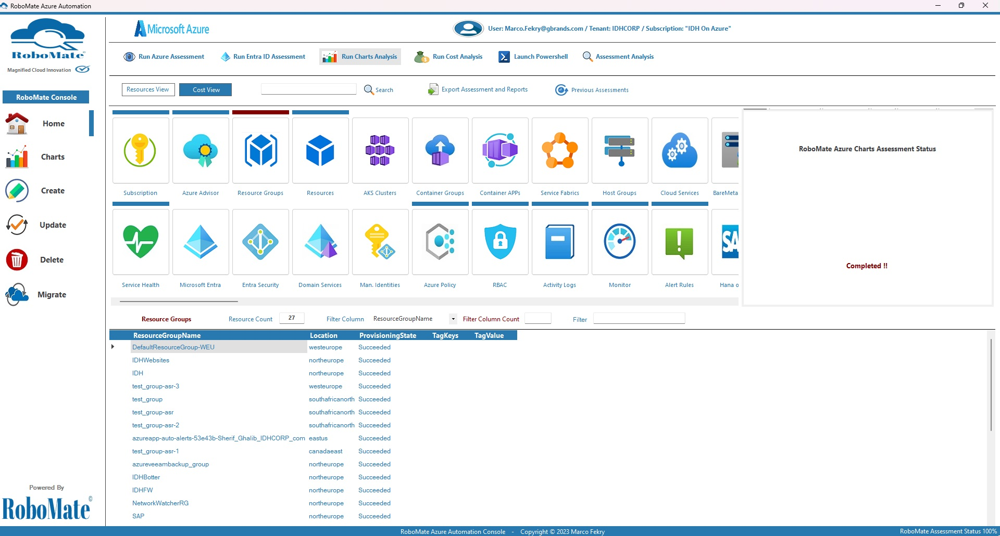

  

<h1 align="center"><strong>RoboMate Cloud Automation</strong></h1>

Developed by Multi-Cloud Consultant /Marco Fekry

What is RoboMate Cloud Automation? 
--------------
RoboMate Cloud Automation is a project created to analyze and manage cloud cost, usage, security, and governance all in one place. With RoboMate Cloud Automation you can also:

Build an inventory of your cloud infrastructure assets.

Control your resource usage and gain visibility across all used services for maximum cost-effectiveness.

Detect potential vulnerabilities that could put your cloud environment at risk using a lot of security cloud standards.

Use RoboMate Cloud Automation built-in reports to gain visibility over all Cloud aspects.

Get a deep understanding of how you spend on AWS, Azure, and OCI.

Just like an expert , Use any of the RoboMate Cloud Automation profiles and convert hours to minutes to build, develop, and secure the cloud environments.

Introduction
------------
A magnified powerful Assessment and Automation AI tool with a friendly user interface to enhance your Cloud productivity and achieve your goals effortlessly

RoboMate Cloud Automation is a cutting-edge solution offering architects comprehensive tools and algorithms to optimize their Cloud workloads. It employs a robust set of frameworks that aid in the effective management of various Cloud services. By leveraging these frameworks, architects can streamline their operations, ensuring reliability and security, while optimizing costs and improving overall performance. 

One of the key advantages of RoboMate Cloud Automation is its focus on reliability. Through intelligent monitoring and automation, RoboMate Cloud Automation continuously monitors Cloud resources, detecting and resolving any issues that may arise. This ensures that applications hosted on the cloud remain available and perform optimally, reducing the risk of downtime and minimizing the impact of disruptions.

RoboMate Cloud Automation also prioritizes security. It incorporates advanced encryption techniques and robust authentication mechanisms to safeguard sensitive data and protect against unauthorized access. With RoboMate Cloud Automation's built-in security features, architects can rest assured that their Cloud workloads are protected from potential threats and vulnerabilities. 

Cost optimization is another area in which RoboMate Cloud Automation excels. Its frameworks provide architects with valuable insights and recommendations to help them optimize their resource allocation and avoid unnecessary expenses. By leveraging advanced algorithms and predictive analytics, RoboMate Cloud Automation identifies potential cost-saving opportunities, allowing architects to make informed choices and maximize their return on investment. 

Performance is crucial to any workload, and RoboMate Cloud Automation ensures that cloud workloads perform at their best. Its frameworks monitor resource utilization, identify bottlenecks, and recommend optimization strategies. By implementing these recommendations, architects can maximize the performance of their applications, resulting in faster response times and improved end-user experience.

RoboMate Cloud Automation supports Microsoft Azure, Amazon Web Services, Oracle Cloud Infrastructure, and Microsoft Office 365 focusing on reliability, availability, security, cost, and performance. 

  

Who is using it?
--------------
RoboMate Cloud Automation was built for every Cloud Engineer, Developer, DevOps engineer, and SRE in mind. We understand that tackling cost savings, security improvements and resource usage analysis efforts can be hard, sometimes just knowing where to start, can be the most challenging part at times. RoboMate Cloud Automation is here to help those cloud practitioners see their cloud resources and accounts much more clearly. Only with clear insight can timely and efficient actions take place with maximum automation deployments which can be done to any of your customers. 

## Demo Videos
[RoboMate Cloud Automation Azure Assessments](https://1drv.ms/v/s!Agmd1-sdw98kkr9e3COJsfF5QYvxLQ?e=vOWIaf)

[RoboMate Cloud Automation AWS Assessments](https://1drv.ms/v/s!Agmd1-sdw98kkuo2IHx0smvIq-bofA?e=vvJpP4)

[RoboMate Cloud Automation OCI Assessments](https://1drv.ms/v/s!Agmd1-sdw98kkuo3ljhDDYIDfGW0cQ?e=iJDbrY)

[RoboMate Cloud Automation Azure Automations](https://1drv.ms/v/s!Agmd1-sdw98kkq93VW0E5XJoC_dNQA?e=1dFT2e)

[RoboMate Cloud Automation AWS Automations](https://1drv.ms/v/s!Agmd1-sdw98kkuo4O4q_cbkpSkphWg?e=bMGqeJ)

[RoboMate Cloud Automation OCI Automations](https://1drv.ms/v/s!Agmd1-sdw98kkuo5rm4u1X9n9qifIg?e=A9USNQ)

OS Requirements
--------------
1- Windows 10 / Windows 11 / Windows Server 2022

HW Requirements
--------------
1- CPU: 4 Cores

2- Memory: 8 GB

3- Storage: 2 GB

4- Display Scaling of 100%

Prerequisites
--------------
1- Local Administrator permissions

2- RoboMate Cloud Automation License ( Contact me at MarcoFekry@hotmail.com for a trial license )

Getting Started
------------
1- Download the RoboMate-Installer.zip file

2- Extract the RoboMate-Installer.zip file contents

3- Run RoboMateInstall.exe

4- Add your RoboMate Cloud Automation License

5- The installation wizard will guide you to complete the installation

6- Complete the installation Wizard
